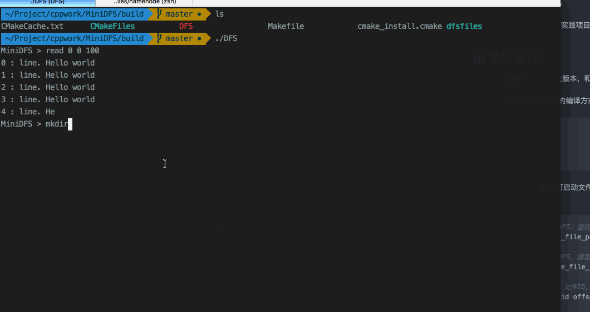

# miniDFS

- [English Version](README_en.md)
- [中文版本](README.md)

来自阿里巴巴云计算课程的实践项目。

## 编译与运行

需要安装`cmake` 3.4及以上版本，和`boost` 1.59.0，要确保编译器支持C++ 11。

建议使用`out-of-source`的编译方式，比如：

```shell
$ mkdir build
$ cd build
$ cmake ..
$ make
```
编译完成后，执行`./DFS`可启动文件系统，然后可以输入miniDFS命令。目前支持的命令：

```shell
# 将本地文件上传到miniDFS；返回ID
MiniDFS > put source_file_path

# 将本地文件上传到miniDFS，指定目标路径；返回ID
MiniDFS > put2 source_file_path des_file_path

# 读取miniDFS上的文件：文件ID，偏移量，长度
MiniDFS > read file_id offset count

# 读取miniDFS上的文件：文件路径，偏移量，长度
MiniDFS > read2 file_path offset count

# 下载miniDFS上的文件：文件ID，保存路径
MiniDFS > fetch file_id save_path

# 下载miniDFS上的文件：文件路径，保存路径
MiniDFS > fetch2 file_path save_path

# 在DFS上创建目录
MiniDFS > mkdir file_dir

# 退出
MiniDFS > quit
```

## 功能说明
目前是利用多线程实现的，模拟分布式环境下TCP通信环境。

使用1个线程作为NameNode，维护整个DFS的元数据信息和任务调度；使用4个线程作为DataNode，负责文件的存储（每个Block默认为2MB）。

实现的功能的包括：

- 文件上传
- 多副本存储
- 文件读取（下载）
- 简单的目录结构

### 存储目录
当前，在当前可执行文件目录，生成的`dfsfiles`文件夹作为DFS文件目录。其中`datanode0/1/2/3`是
每个dataserver的存储目录；namenode是nameserver的存储目录。

文件被拆分后的命令方法和HDFS类似，比如`a.txt-part0`。

### 数据校验
Mac OSX仅支持`md5`命令，Linux中同样功能的命令是`md5sum`（可选参数不同）。

**副本数据的一致性：**
假设datanode0和datanode1均有a.txt的第一个block信息：

```shell
$ cd dfsfiles
$ diff <(md5 -q datanode0/a.txt-part0) <(md5 -q datanode1/a.txt-part0)
```

**原始数据和DFS数据的一致性：**

比如对于原始文件`testFiles/a.txt`，假设文件ID是0。首先使用`fetch`命令，下载
```shell
MiniDFS > fetch 0 b.txt
```
然后，
```shell
$ diff <(md5 -q ../testFiles/a.txt) <(md5 -q b.txt)
```

## 功能演示



## Feature works
- 更复杂的目录结构，实现HDFS目录管理的基本功能
- 利用心跳信息进行DFS健康度检查，和错误恢复
- 使用套接字通信，完成模拟DFS功能
